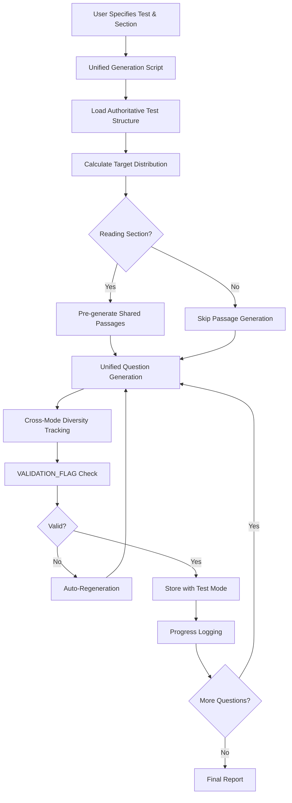

# Question Generation End-to-End Flow - Unified System

## Overview

This document describes the unified question generation system that generates ALL questions for a section across ALL test modes (practice tests 1-5, diagnostic, and drills) in a single operation, ensuring diversity and preventing duplicates.

## Key Improvements Over Legacy System

- **Unified Generation**: All test modes generated together with shared context
- **Cross-Mode Diversity**: Prevents duplicate topics/scenarios across practice tests
- **Shared Passage System**: Pre-generates passages for efficient reuse
- **Prevention-Based Quality**: Enhanced prompts prevent errors rather than catch them
- **Educational Value**: Structured explanations with actionable tips
- **Authoritative Data**: Uses curriculumData.ts as single source of truth

## Architecture Overview



---

## 1. User Input & Unified Generation

### 1.1 Unified Generation Command

The unified system uses a single command structure for all products and sections:

```bash
npm run regenerate-section -- --test-type "Test Product Name" --section "Section Name" [options]
```

### 1.2 Command Parameters

- `--test-type`: Full test product name (must match curriculumData.ts exactly)
- `--section`: Section to generate (must match curriculumData.ts exactly)
- `--clean-first`: Delete existing questions before generating (optional)
- `--skip-confirmation`: Auto-proceed without prompts (optional)
- `--validate-after`: Run validation checks after generation (optional)

### 1.3 Example Commands

```bash
# EduTest Scholarship - Verbal Reasoning
npm run regenerate-section -- --test-type "EduTest Scholarship (Year 7 Entry)" --section "Verbal Reasoning" --skip-confirmation

# VIC Selective Entry - Reading Reasoning with cleanup
npm run regenerate-section -- --test-type "VIC Selective Entry (Year 9 Entry)" --section "Reading Reasoning" --clean-first --skip-confirmation

# ACER Scholarship - Humanities (treated as reading comprehension)
npm run regenerate-section -- --test-type "ACER Scholarship (Year 7 Entry)" --section "Humanities" --skip-confirmation
```

---

## 2. Authoritative Test Structure

### 2.1 Loading from curriculumData.ts

The system reads exact specifications from `TEST_STRUCTURES`:

```typescript
const testStructure = TEST_STRUCTURES[testType];
const sectionStructure = testStructure[sectionName];

// Authoritative data includes:
// - questions: Exact count per practice test
// - time: Time limit in minutes
// - format: "Multiple Choice" or "Written Response"
// - passages: Number of passages (for reading sections)
// - words_per_passage: Word count per passage
```

### 2.2 Validation Against Authoritative Data

The system validates all generation parameters:

```typescript
console.log(`📚 AUTHORITATIVE DATA - ${testType} - ${sectionName}:`);
console.log(`   Questions per practice test: ${authoritativeQuestions} (FIXED)`);
console.log(`   Format: ${authoritativeFormat}`);
console.log(`   Time: ${authoritativeTime} minutes`);
if (authoritativePassages > 0) {
  console.log(`   Passages: ${authoritativePassages} passages, ${authoritativeWordsPerPassage} words each`);
}
```

### 2.3 Sub-skill Distribution

Sub-skills are loaded from `SECTION_TO_SUB_SKILLS`:
- Questions distributed evenly across sub-skills
- Difficulty levels balanced within each sub-skill
- Special handling for writing sections (fewer questions)

---

## 3. Unified Question Generation Engine

### 3.1 Pre-Generation Phase

#### Target Distribution Calculation
```typescript
const targetDistribution = calculateSectionDistribution(testType, sectionName);
// Returns: { practice_1: 60, practice_2: 60, ..., diagnostic: 48, drill: 240 }
```

#### Shared Passage Pre-Generation (Reading Sections Only)
```typescript
if (isReadingSection(sectionName)) {
  sharedPassagesMap = await generateSharedPassagesForReading(request, targetDistribution);
  // Generates: 5 passages × 5 practice tests + 5 diagnostic passages
}
```

#### Cross-Mode Context Initialization
```typescript
const unifiedContext = initializeUnifiedContext(testType, sectionName, totalQuestions);
// Tracks: usedTopics, usedScenarios, usedCharacters, usedSettings
```

### 3.2 Unified Generation Loop

The main generation loop processes all sub-skills with shared context:

```typescript
for (const plan of subSkillPlans) {
  for (const difficultyGroup of plan.difficultyBreakdown) {
    // Calculate proper test mode assignments
    const testModeAssignments = calculateTestModeAssignments(difficultyGroup, plan.distribution);
    
    for (let i = 0; i < difficultyGroup.count; i++) {
      const assignedTestMode = testModeAssignments[i];
      
      // Generate with diversity tracking
      const question = await generateQuestion(questionRequest);
      
      // Store with correct test mode
      await storeQuestion(question, testType, assignedTestMode, ...);
    }
  }
}
```

### 3.3 Passage Generation Strategies

#### Practice Tests & Diagnostic (Reading Sections)
- **Strategy**: Pre-generate shared passages
- **Count**: As per curriculumData (e.g., 5 passages for EduTest)
- **Length**: As per curriculumData (e.g., 200 words)
- **Distribution**: ~10 questions per passage
- **Storage**: Generated once, referenced by multiple questions

#### Drills (Reading Sections)
- **Strategy**: Generate mini-passages on demand
- **Count**: 1:1 ratio (one passage per question)
- **Length**: 100 words (focused content)
- **Purpose**: Test specific sub-skills with targeted content

#### Non-Reading Sections
- **No passages required**
- **Direct question generation**
- **Focus on subject-specific content**

---

## 4. Enhanced Validation Pipeline

### 4.1 VALIDATION_FLAG Self-Flagging System

Claude is instructed to self-flag problematic questions:

```typescript
🚨 REGENERATION FLAGS (use "VALIDATION_FLAG" if ANY apply):
- You cannot confidently verify that exactly one answer is correct
- Your calculated answer doesn't match any of the 4 options you created
- You feel uncertain about the mathematical or logical correctness
- The question seems to have no valid solution or multiple valid solutions
- You notice any contradictions between question, options, and solution
```

### 4.2 Validation Detection

The system checks for the flag in the solution:

```typescript
const hasValidationFlag = solution.includes('VALIDATION_FLAG');
if (hasValidationFlag) {
  confidence = 0; // Immediate regeneration
  errors.push('Claude flagged this question as potentially problematic');
}
```

### 4.3 Mathematical Validation

For mathematics sections, additional validation ensures accuracy:
- Independent solution verification
- Answer option matching
- Logical consistency checks
- Reasonable result validation

### 4.4 Distractor Quality Mandates

Enhanced prompts ensure quality distractors:
```typescript
🎯 DISTRACTOR QUALITY MANDATE - CRITICAL FOR VALID ASSESSMENT:
For each wrong answer option, you MUST ensure it is:
1. ✅ Plausible enough that a student might reasonably choose it
2. ✅ Definitively wrong - cannot be defended as correct under any interpretation
```

---

## 5. Cross-Mode Diversity System

### 5.1 Diversity Tracking Components

The unified context tracks:
- **Topics**: Science, history, sports, technology, etc.
- **Scenarios**: School, home, workplace, outdoor settings
- **Characters**: Names, professions, backgrounds
- **Settings**: Urban, rural, historical, contemporary
- **Writing Styles**: Narrative, informational, persuasive

### 5.2 Context Management

```typescript
const contextVariation = createEnhancedContextVariation(
  unifiedContext,
  plan.subSkill,
  difficultyGroup.difficulty,
  allQuestions.length
);
```

The system:
- Maintains global tracking across all test modes
- Rotates used elements periodically
- Ensures no repetition within practice tests
- Maximizes variety across the entire section

### 5.3 Diversity Metrics

Final report includes:
```typescript
📊 GENERATION RESULTS:
   Questions Generated: 588
   Diversity Score: 94/100
   Topic Variety: High (47 unique topics)
   Scenario Variety: High (32 unique scenarios)
```

---

## 6. Test Mode Assignment

### 6.1 Proper Distribution Algorithm

Questions are assigned to test modes BEFORE database storage:

```typescript
function calculateTestModeAssignments(difficultyGroup, subSkillDistribution) {
  // For practice tests: distribute evenly across practice_1 through practice_5
  if (difficultyGroup.testModes.includes('practice_1')) {
    const basePerTest = Math.floor(totalQuestions / 5);
    const remainder = totalQuestions % 5;
    
    // Create balanced assignment
    for (let i = 0; i < 5; i++) {
      const count = basePerTest + (i < remainder ? 1 : 0);
      // Add assignments for practice_{i+1}
    }
  }
  
  // Shuffle to avoid predictable patterns
  return shuffleArray(assignments);
}
```

### 6.2 Storage with Correct Test Mode

```typescript
// Each question stored with its assigned test mode
const questionId = await storeQuestion(
  generatedQuestion,
  testType,
  assignedTestMode, // e.g., "practice_3", not always "practice_1"
  sectionName,
  subSkill,
  difficulty
);
```

---

## 7. Requirements Compliance

### 7.1 Writing Sections

**Drill Quantity**: Always 6 questions per sub-skill
- 2 Easy (difficulty 1)
- 2 Medium (difficulty 2)
- 2 Hard (difficulty 3)

**Key Implementation**:
```typescript
if (isWritingSection(sectionName)) {
  return 6; // Never 30
}
```

### 7.2 Reading/Humanities Sections

**ACER Humanities**: Treated as reading comprehension
```typescript
const readingSections = [
  'Reading',
  'Reading Reasoning', 
  'Reading Comprehension',
  'Humanities' // ACER Humanities is treated as reading comprehension
];
```

**Passage Requirements**:
- Practice/Diagnostic: Shared passages (multiple questions per passage)
- Drills: Mini-passages (1:1 ratio)

### 7.3 Australian Context

**Enforced Requirements**:
- UK/Australian spelling: colour, centre, realise, metre, analyse
- Currency: Australian dollars (AUD)
- Geography: Australian cities, states, landmarks
- Education: Year levels (not grades)
- Culture: Local sports, holidays, customs

**Implementation in Prompts**:
```typescript
- Use UK/Australian spelling throughout ("colour", "realise", "centre", "metre", "analyse")
- Set monetary values in Australian dollars (AUD)
- Use Australian geographical locations and cultural references where appropriate
```

---

## 8. Generation Scripts for All Products

### 8.1 Unified Commands by Product

#### VIC Selective Entry (Year 9 Entry)
```bash
npm run regenerate-section -- --test-type "VIC Selective Entry (Year 9 Entry)" --section "Reading Reasoning"
npm run regenerate-section -- --test-type "VIC Selective Entry (Year 9 Entry)" --section "Mathematics Reasoning"
npm run regenerate-section -- --test-type "VIC Selective Entry (Year 9 Entry)" --section "General Ability - Verbal"
npm run regenerate-section -- --test-type "VIC Selective Entry (Year 9 Entry)" --section "General Ability - Quantitative"
npm run regenerate-section -- --test-type "VIC Selective Entry (Year 9 Entry)" --section "Writing"
```

#### NSW Selective Entry (Year 7 Entry)
```bash
npm run regenerate-section -- --test-type "NSW Selective Entry (Year 7 Entry)" --section "Reading"
npm run regenerate-section -- --test-type "NSW Selective Entry (Year 7 Entry)" --section "Mathematical Reasoning"
npm run regenerate-section -- --test-type "NSW Selective Entry (Year 7 Entry)" --section "Thinking Skills"
npm run regenerate-section -- --test-type "NSW Selective Entry (Year 7 Entry)" --section "Writing"
```

#### Year 5 & 7 NAPLAN
```bash
npm run regenerate-section -- --test-type "Year 5 NAPLAN" --section "Writing"
npm run regenerate-section -- --test-type "Year 5 NAPLAN" --section "Reading"
npm run regenerate-section -- --test-type "Year 5 NAPLAN" --section "Language Conventions"
npm run regenerate-section -- --test-type "Year 5 NAPLAN" --section "Numeracy No Calculator"
npm run regenerate-section -- --test-type "Year 5 NAPLAN" --section "Numeracy Calculator"
```

#### EduTest Scholarship (Year 7 Entry)
```bash
npm run regenerate-section -- --test-type "EduTest Scholarship (Year 7 Entry)" --section "Reading Comprehension"
npm run regenerate-section -- --test-type "EduTest Scholarship (Year 7 Entry)" --section "Verbal Reasoning"
npm run regenerate-section -- --test-type "EduTest Scholarship (Year 7 Entry)" --section "Numerical Reasoning"
npm run regenerate-section -- --test-type "EduTest Scholarship (Year 7 Entry)" --section "Mathematics"
npm run regenerate-section -- --test-type "EduTest Scholarship (Year 7 Entry)" --section "Written Expression"
```

#### ACER Scholarship (Year 7 Entry)
```bash
npm run regenerate-section -- --test-type "ACER Scholarship (Year 7 Entry)" --section "Written Expression"
npm run regenerate-section -- --test-type "ACER Scholarship (Year 7 Entry)" --section "Mathematics"
npm run regenerate-section -- --test-type "ACER Scholarship (Year 7 Entry)" --section "Humanities"  # Treated as reading
```

### 8.2 Batch Processing

For complete product generation:
```bash
# Generate all sections for a product
for section in "Reading Comprehension" "Verbal Reasoning" "Numerical Reasoning" "Mathematics" "Written Expression"; do
  npm run regenerate-section -- --test-type "EduTest Scholarship (Year 7 Entry)" --section "$section" --skip-confirmation
done
```

---

## 9. Progress Monitoring

### 9.1 Real-time Progress Display

The system shows detailed progress during generation:

```
🚀 Starting unified generation for Verbal Reasoning in EduTest Scholarship (Year 7 Entry)
📊 Target distribution for Verbal Reasoning:
   practice_1: 60 questions
   practice_2: 60 questions
   practice_3: 60 questions
   practice_4: 60 questions
   practice_5: 60 questions
   diagnostic: 48 questions
   drill: 240 questions
   TOTAL: 588 questions

🔄 Generating questions for Analogical Reasoning & Word Relationships...
   Difficulty 1: 12 questions
      Distribution: practice_1:2, practice_2:3, practice_3:2, practice_4:3, practice_5:2
   ✅ Generated question 1/588 (0%) - practice_2
   ✅ Generated question 2/588 (0%) - practice_5
   ✅ Generated question 3/588 (1%) - practice_1
```

### 9.2 Validation Logging

```
✅ Question validated (confidence: 100%)
🚨 VALIDATION_FLAG detected - Claude identified issues with this question
❌ Question validation failed on attempt 2 (confidence: 45%): ["Mathematical discrepancy detected"]
```

### 9.3 Final Generation Report

```
🎉 REGENERATION SUMMARY:
   Status: SUCCESS
   Questions Generated: 588
   Diversity Score: 94/100
   Total Duration: 1247s
   Errors: 0
   Warnings: 2

📊 DISTRIBUTION BY TEST MODE:
   practice_1: 60 questions
   practice_2: 60 questions
   practice_3: 60 questions
   practice_4: 60 questions
   practice_5: 60 questions
   diagnostic: 48 questions
   drill: 240 questions

🎯 SUB-SKILL BREAKDOWN:
   Analogical Reasoning & Word Relationships: 71 questions (diversity: 92/100)
   Vocabulary & Semantic Knowledge: 71 questions (diversity: 95/100)
   [... more sub-skills ...]

✅ Section regeneration completed successfully!
   - All test modes now have fresh, diverse questions
   - Zero duplicates across practice tests, drills, and diagnostic
   - Enhanced educational explanations with actionable tips
```

---

## 10. Quality Assurance

### 10.1 Built-in Quality Checks

#### Authoritative Data Validation
- Verifies question counts match curriculumData.ts
- Validates sub-skill alignment
- Checks passage requirements

#### Cross-Mode Diversity Verification
- Ensures no duplicate topics across practice tests
- Validates character name uniqueness
- Checks scenario variety

#### Test Mode Distribution Balance
- Verifies even distribution across practice tests
- Validates difficulty progression
- Checks sub-skill coverage

#### Australian Context Compliance
- Validates spelling conventions
- Checks currency formatting
- Verifies cultural appropriateness

### 10.2 Educational Value Enhancement

#### Structured Solution Format
```
**Correct Answer: [Letter]**
[Clear explanation of why this answer is correct]

**Why Other Options Are Wrong:**
- A: [Specific reason why incorrect]
- B: [Specific reason why incorrect]
- C: [Specific reason why incorrect]
- D: [Specific reason why incorrect]

**Tips for Similar Questions:**
• [Strategy for this type of question]
• [Pattern recognition technique]
• [Common mistake to avoid]
```

#### Subject-Specific Tips
- Over 200 actionable strategies organized by subject
- Tips tailored to sub-skill and difficulty level
- Age-appropriate guidance for students

---

## 11. Error Handling and Recovery

### 11.1 Automatic Recovery Mechanisms

- **API Rate Limits**: Exponential backoff with retry
- **Validation Failures**: Auto-regeneration up to 3 attempts
- **Passage Generation Errors**: Fallback to standalone questions
- **Storage Failures**: Transaction rollback with detailed logging

### 11.2 Manual Intervention Points

- **Persistent Validation Failures**: Logged for manual review
- **Diversity Threshold Breaches**: Warning with continuation option
- **API Quota Exhaustion**: Graceful pause with resume capability

---

## 12. Production Deployment

### 12.1 Environment Requirements

```bash
# Required environment variables
VITE_CLAUDE_API_KEY=your_anthropic_api_key
VITE_SUPABASE_URL=your_supabase_project_url
VITE_SUPABASE_ANON_KEY=your_supabase_anon_key
```

### 12.2 Pre-Deployment Checklist

- [ ] Verify curriculumData.ts is up to date
- [ ] Test unified generation for sample section
- [ ] Validate passage generation for reading sections
- [ ] Check Australian context compliance
- [ ] Review validation thresholds
- [ ] Test error recovery mechanisms

### 12.3 Monitoring Production Generation

- Track generation success rates by product/section
- Monitor validation failure patterns
- Review diversity metrics trends
- Analyze generation time performance
- Audit Australian context compliance

---

## Summary

The unified question generation system represents a significant advancement in educational content creation:

**Architectural Improvements**:
- Single operation generates all test modes with shared context
- Pre-generated shared passages for efficient question creation
- Cross-mode diversity tracking prevents content repetition
- Proper test mode assignment before database storage

**Quality Enhancements**:
- VALIDATION_FLAG self-flagging catches problems early
- Prevention-based prompts reduce error rates
- Enhanced educational value with structured explanations
- Australian context fully integrated

**Operational Benefits**:
- Simplified command structure for all products
- Real-time progress monitoring
- Comprehensive final reports
- Automatic error recovery

The system is production-ready for generating high-quality, diverse question banks across all 6 test products while maintaining strict quality standards and educational value.