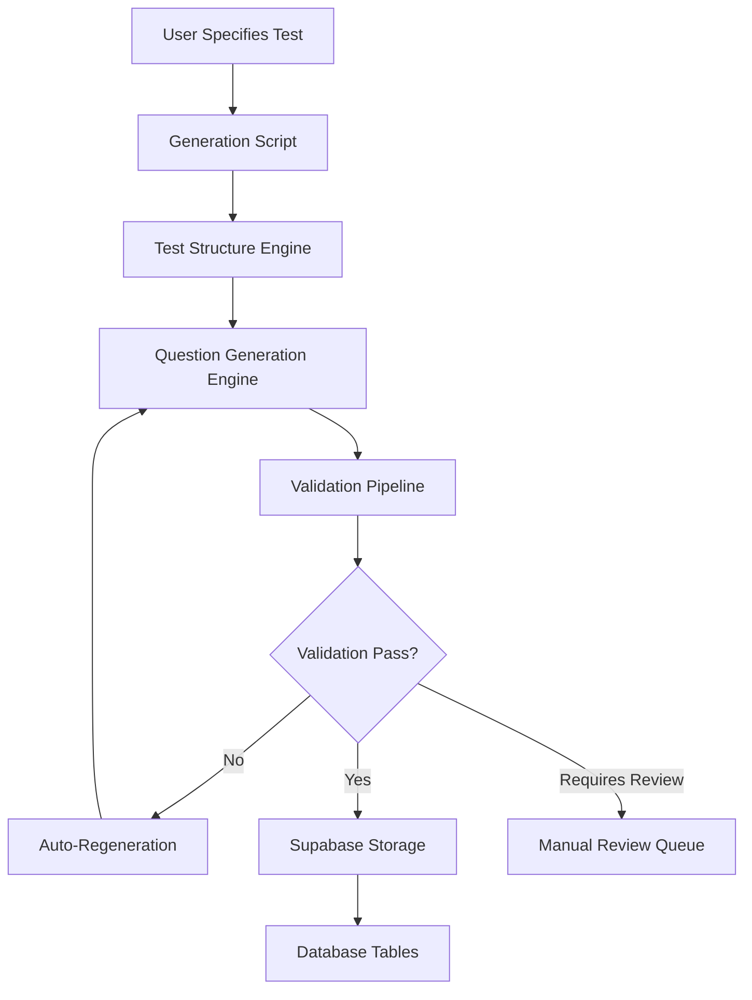

# Question Generation End-to-End Flow

## Overview

This document describes the complete end-to-end flow of question generation in the EduCourse platform, from user specification to final database storage with validation.

## Architecture Overview



---

## 1. User Input & Script Creation

### 1.1 User Specification
The user specifies what they want to generate:
- **Test Type**: `'VIC Selective Entry (Year 9 Entry)'`, `'NSW Selective Entry (Year 7 Entry)'`, etc.
- **Test Mode**: `'diagnostic'`, `'practice_1'`, `'practice_2'`, `'drill'`, etc.
- **Optional**: Specific sections, difficulty distribution, question counts

### 1.2 Generation Script
User creates or runs a generation script (e.g., `generate-vic-selective-practice1.ts`):

```typescript
// Example script structure
import { generateCompleteTest } from '../src/engines/questionGeneration/index.ts';

async function main() {
  const result = await generateCompleteTest(
    'VIC Selective Entry (Year 9 Entry)',  // Test Type
    'practice_1',                          // Test Mode
    'Medium'                               // Difficulty (auto-distributed for practice)
  );
}
```

**Script Location**: `/scripts/generate-[product]-[testmode].ts`

---

## 2. Test Structure Engine

### 2.1 Authoritative Test Structure
The script calls `getAuthoritativeTestStructure()` which loads configuration from:
- **File**: `src/data/curriculumData.ts`
- **Key Object**: `TEST_STRUCTURES`

```typescript
// Example structure
TEST_STRUCTURES = {
  'VIC Selective Entry (Year 9 Entry)': {
    sections: {
      'Reading Reasoning': {
        totalQuestions: 35,
        timeLimit: 30,
        subSkills: ['Reading Comprehension', 'Inference', 'Vocabulary'],
        passages: 5,
        wordsPerPassage: 250
      },
      'Mathematics Reasoning': {
        totalQuestions: 35,
        timeLimit: 30,
        subSkills: ['Algebra', 'Geometry', 'Statistics']
      },
      'Writing': {
        totalQuestions: 1,
        timeLimit: 25,
        subSkills: ['Creative Writing'],
        format: 'Written Response'
      }
    }
  }
}
```

### 2.2 Question Distribution Logic
The engine automatically calculates:
- **Questions per sub-skill**: `totalQuestions ÷ subSkills.length`
- **Difficulty distribution**: Based on test type (e.g., VIC Selective: 10% easy, 35% medium, 55% hard)
- **Passage requirements**: For reading sections

---

## 3. Question Generation Engine

### 3.1 Batch Generation Process
The main engine (`src/engines/questionGeneration/index.ts`) processes each section:

```typescript
for (const [sectionName, sectionConfig] of Object.entries(sections)) {
  // Generate passages if required
  if (sectionConfig.requiresPassages) {
    const passages = await generatePassages(sectionName, sectionConfig);
  }
  
  // Generate questions for each sub-skill
  for (const subSkill of sectionConfig.subSkills) {
    const questions = await generateQuestionsForSubSkill(
      testType, testMode, sectionName, subSkill, difficulty
    );
  }
}
```

### 3.2 Individual Question Generation
For each question, the engine (`src/engines/questionGeneration/questionGeneration.ts`):

1. **Builds Claude API Prompt** using `buildQuestionPrompt()`
2. **Calls Claude API** with retry logic via `callClaudeAPIWithRetry()`
3. **Parses Response** using `parseClaudeResponse()`
4. **Creates Question Object** with all required database fields

```typescript
const question: GeneratedQuestion = {
  question_text: parsedQuestion.question_text,
  answer_options: parsedQuestion.answer_options,
  correct_answer: parsedQuestion.correct_answer,
  solution: parsedQuestion.solution,
  // ... visual fields ...
  test_type: request.testType,
  section_name: request.sectionName,
  sub_skill: request.subSkill,
  difficulty: request.difficulty,
  response_type: request.responseType,
  max_points: calculateMaxPoints(testType, subSkill, responseType), // NEW
  product_type: testType, // NEW
  generation_metadata: {
    generation_timestamp: new Date().toISOString(),
    attempt_number: attempt,
    prompt_length: prompt.length
  }
};
```

### 3.3 Max Points Calculation
The engine automatically calculates `max_points` based on question type:

```typescript
function calculateMaxPoints(testType: string, subSkill: string, responseType: ResponseType): number {
  // Writing questions have higher point values
  if (responseType === 'extended_response' || subSkill.includes('Writing')) {
    if (testType === 'NSW Selective Entry (Year 7 Entry)') return 50;
    if (testType === 'VIC Selective Entry (Year 9 Entry)') return 30;
    if (testType === 'Year 5 NAPLAN' || testType === 'Year 7 NAPLAN') return 48;
    if (testType === 'EduTest Scholarship (Year 7 Entry)') return 15;
    if (testType === 'ACER Scholarship (Year 7 Entry)') return 20;
  }
  return 1; // Multiple choice questions
}
```

---

## 4. Validation Pipeline

### 4.1 Enhanced Generation with Validation
The enhanced generation system (`src/engines/questionGeneration/enhancedQuestionGeneration.ts`) adds validation:

```typescript
export async function generateQuestionWithValidation(
  request: EnhancedQuestionRequest
): Promise<EnhancedGenerationResult> {
  for (let attempt = 1; attempt <= maxAttempts; attempt++) {
    // Generate question
    const question = await generateBasicQuestion(request, attempt);
    
    // Run validation pipeline
    const validationResult = await validateQuestionWithPipeline(question);
    
    // Check if validation passed
    if (validationResult.isValid) {
      return { question, validationResult, regenerationCount, ... };
    }
    
    // Auto-regenerate if validation failed
    if (validationResult.shouldRegenerate && attempt < maxAttempts) {
      console.log('Validation failed - regenerating...');
      continue;
    }
  }
}
```

### 4.2 Enhanced Self-Flagging Validation System
The current validation system uses Claude's self-flagging approach for enhanced quality control:

#### Claude Self-Flagging Instructions
In the prompt generation (`src/engines/questionGeneration/claudePrompts.ts`), Claude is instructed to include a "VALIDATION_FLAG" if it detects any issues:

```typescript
CRITICAL QUALITY CONTROL:
If you detect ANY of the following issues while creating this question, include the exact phrase "VALIDATION_FLAG" at the start of your solution field:

🚨 VALIDATION FLAGS (use "VALIDATION_FLAG" if ANY apply):
- Your calculated answer doesn't match any of the 4 options you created
- You need to recalculate or try a different approach during generation  
- The question seems impossible or has no valid answer
- You're uncertain about the correctness of your question/solution
- The math doesn't work out properly
- The options don't include the correct mathematical result
```

#### Validation Detection Process
The validation engine (`src/engines/questionGeneration/questionGeneration.ts`) checks for this flag:

```typescript
async function validateQuestionWithHallucinationCheck(question, request) {
  // Step 1: Basic structural validation
  const basicValidation = validateQuestion(question);
  
  // Step 2: Check for Claude's self-flagging (skip for writing sections)
  const isWritingSection = request.responseType === 'extended_response';
  const solution = question.solution || '';
  const hasValidationFlag = !isWritingSection && solution.includes('VALIDATION_FLAG');
  
  let confidence = 100;
  
  if (hasValidationFlag) {
    confidence = 0; // Immediate regeneration
    errors.push('Claude flagged this question as potentially problematic (VALIDATION_FLAG detected)');
    console.log(`🚨 VALIDATION_FLAG detected - Claude identified issues with this question`);
  }
  
  return { isValid: errors.length === 0 && confidence >= 75, confidence, errors };
}
```

#### Automatic Regeneration
When VALIDATION_FLAG is detected:
- **Confidence set to 0%**: Triggers immediate regeneration
- **Error logged**: "Claude flagged this question as potentially problematic" 
- **Solution cleaned**: Flag removed from final solution for logging
- **Max attempts respected**: Still limited by maximum regeneration attempts

### 4.3 Validation Configuration
The validation system now uses a simplified approach:

```typescript
// Multiple choice questions (all subjects) - Self-flagging validation
{
  enableSelfFlagging: true,
  minimumConfidenceThreshold: 75,
  maxRegenerationAttempts: 3,
  validateStructure: true
}

// Writing questions - Basic validation only
{
  enableSelfFlagging: false, // Skip for extended response
  minimumConfidenceThreshold: 50,
  maxRegenerationAttempts: 2,
  validateStructure: true
}
```

### 4.4 Validation Results
The simplified validation returns:
- **isValid**: Whether question passes all checks (structural + confidence >= 75%)
- **confidence**: 0-100 confidence score (0 if VALIDATION_FLAG detected)
- **errors**: Critical issues requiring regeneration
- **warnings**: Minor structural issues
- **score**: Overall quality score based on errors and warnings

---

## 5. Auto-Regeneration Logic

### 5.1 Regeneration Criteria
Questions are auto-regenerated if:
- **VALIDATION_FLAG detected** (Claude self-flagged the question)
- **Structural validation fails** (missing fields, invalid format)
- **Confidence below threshold** (default 75%)
- **Attempt count < max attempts** (default 3)

### 5.2 Regeneration Process
```typescript
for (let attempt = 1; attempt <= maxAttempts; attempt++) {
  // Generate question
  const question = await generateQuestion(request);
  
  // Validate with hallucination check
  const validation = await validateQuestionWithHallucinationCheck(question, request);
  
  if (validation.isValid) {
    console.log(`✅ Question validated (confidence: ${validation.confidence}%)`);
    return question;
  } else {
    console.warn(`❌ Question validation failed on attempt ${attempt} (confidence: ${validation.confidence}%):`, validation.errors);
    if (attempt === maxAttempts) {
      throw new Error(`Question validation failed after ${maxAttempts} attempts: ${validation.errors.join(', ')}`);
    }
  }
}
```

### 5.3 Failure Handling
If max attempts reached:
- **VALIDATION_FLAG failures**: Throw error and stop generation (critical quality issue)
- **Structural failures**: Throw error and stop generation (missing required fields)
- **Low confidence**: Throw error with detailed failure reasons
- **Log patterns**: All failures logged with confidence scores and error details

---

## 6. Supabase Storage

### 6.1 Database Storage Process
The storage engine (`src/engines/questionGeneration/supabaseStorage.ts`) handles database insertion:

```typescript
export async function storeQuestion(
  question: GeneratedQuestion,
  testType: string,
  testMode: string,
  sectionName: string,
  subSkill: string,
  difficulty: number,
  passageId?: string,
  questionOrder?: number
): Promise<string>
```

### 6.2 Database Field Mapping
The storage function maps all question fields to database columns:

```typescript
const { data, error } = await supabase
  .from('questions')
  .insert({
    // Core fields
    test_type: testType,
    test_mode: testMode,
    section_name: sectionName,
    sub_skill: subSkill,
    sub_skill_id: await getSubSkillId(subSkill), // UUID lookup
    difficulty: difficulty,
    
    // Question content
    question_text: question.question_text,
    answer_options: question.answer_options,
    correct_answer: question.correct_answer,
    solution: question.solution,
    response_type: responseType,
    
    // Visual content
    has_visual: question.has_visual,
    visual_type: question.visual_type,
    visual_data: question.visual_data,
    visual_svg: question.visual_svg,
    
    // Relationships
    passage_id: passageId,
    
    // Metadata
    year_level: getYearLevelFromTestType(testType),
    product_type: getProductTypeFromTestType(testType),
    max_points: calculateMaxPoints(testType, subSkill, responseType),
    question_order: questionOrder,
    generated_by: 'claude-sonnet-4',
    curriculum_aligned: true
  });
```

### 6.3 Database Tables

#### Primary Table: `questions`
All generated questions are stored in the main questions table with these key fields:
- **Core**: `id`, `test_type`, `test_mode`, `section_name`, `sub_skill`
- **Content**: `question_text`, `answer_options`, `correct_answer`, `solution`
- **Scoring**: `max_points`, `response_type`, `difficulty`
- **Metadata**: `product_type`, `year_level`, `generated_by`, `created_at`

#### Supporting Table: `passages`
Reading passages are stored separately and linked via `passage_id`:
- **Content**: `title`, `content`, `word_count`, `passage_type`
- **Metadata**: `difficulty`, `australian_context`, `test_type`, `section_name`

### 6.4 Storage Validation
Before storage, the system:
- **Validates required fields** are populated
- **Checks foreign key constraints** (passage_id, sub_skill_id)
- **Logs storage results** with point values and relationships
- **Returns question ID** for batch tracking

---

## 7. Generation Scripts and Workflow

### 7.1 Script Structure
Generation scripts follow a standard pattern:

```typescript
#!/usr/bin/env node
import dotenv from 'dotenv';
dotenv.config();

import { generateCompleteTest, getAuthoritativeTestStructure } from '../src/engines/questionGeneration/index.ts';

async function main() {
  // 1. Load test structure
  const testStructure = getAuthoritativeTestStructure('VIC Selective Entry (Year 9 Entry)');
  
  // 2. Display structure and progress
  console.log('Test Structure:', testStructure);
  
  // 3. Generate complete test
  const result = await generateCompleteTest(
    'VIC Selective Entry (Year 9 Entry)',
    'practice_1',
    'Medium'
  );
  
  // 4. Display results
  console.log('Generation Complete:', result);
}

main().catch(console.error);
```

### 7.2 Available Scripts
Current generation scripts in `/scripts/`:
- `generate-vic-selective-diagnostic.ts`
- `generate-vic-selective-practice1.ts`
- `generate-vic-selective-practice3.ts`
- `generate-vic-selective-drill.ts`

### 7.3 Running Scripts
```bash
# Run specific generation script
npx tsx scripts/generate-vic-selective-practice1.ts

# Run with environment variables
CLAUDE_API_KEY=your_key npx tsx scripts/generate-vic-selective-practice1.ts
```

---

## 8. Error Handling and Recovery

### 8.1 Generation Errors
- **API Rate Limits**: Automatic retry with exponential backoff
- **Parsing Errors**: Retry with different prompt variations
- **Validation Failures**: Auto-regeneration up to max attempts
- **Storage Errors**: Transaction rollback and error logging

### 8.2 Logging and Monitoring
```typescript
// Generation logging
console.log(`✅ Stored question: ${subSkill} [${maxPoints} points] (ID: ${questionId})`);

// Validation logging
logValidationResult({
  questionId: questionId,
  testType: testType,
  subSkill: subSkill,
  validationResult: result,
  timestamp: new Date().toISOString()
});
```

### 8.3 Quality Metrics
The system tracks:
- **Generation success rate** per test type/section
- **Validation pass rate** and confidence scores
- **Regeneration frequency** and failure patterns
- **Storage success rate** and performance

---

## 9. Configuration and Customization

### 9.1 Test Structure Configuration
**IMPORTANT**: `src/data/curriculumData.ts` is the authoritative source of truth:
- **DO NOT MODIFY** - Contains all possible sub-skills and test structures
- For writing sections with more sub-skills than questions, system randomly selects which sub-skills to use
- Question counts, time limits, and passage requirements are definitive
- Sub-skill mappings in `SECTION_TO_SUB_SKILLS` must match section names in `TEST_STRUCTURES`

### 9.2 Validation Configuration
Validation is now standardized with self-flagging:
```typescript
// All multiple choice questions use same validation approach
const validation = await validateQuestionWithHallucinationCheck(question, request);

// Writing questions skip VALIDATION_FLAG check
const isWritingSection = request.responseType === 'extended_response';
const hasValidationFlag = !isWritingSection && solution.includes('VALIDATION_FLAG');
```

### 9.3 Generation Parameters
Scripts can customize:
- **Batch size**: Questions generated per API call
- **Max attempts**: Regeneration limits
- **Difficulty override**: Force specific difficulty distribution
- **Visual generation**: Enable/disable visual questions

---

## 10. Quality Assurance and Testing

### 10.1 Schema Compatibility Testing
```bash
npx tsx scripts/test-schema-compatibility.ts
```
Verifies all database fields are properly populated.

### 10.2 Validation Pipeline Testing
```bash
npx tsx scripts/test-validation-simple.ts
```
Tests validation pipeline with known problematic questions.

### 10.3 End-to-End Testing
```bash
npx tsx scripts/test-full-generation.ts
```
Complete generation test with validation and storage.

---

## 11. Production Deployment

### 11.1 Environment Setup
Required environment variables:
```bash
VITE_CLAUDE_API_KEY=your_anthropic_api_key
VITE_SUPABASE_URL=your_supabase_project_url
VITE_SUPABASE_ANON_KEY=your_supabase_anon_key
```

### 11.2 Deployment Checklist
- [ ] Environment variables configured
- [ ] Database schema up to date with migrations
- [ ] Test structure data populated in `curriculumData.ts`
- [ ] Validation pipeline tested and configured
- [ ] Generation scripts tested for target products
- [ ] Error logging and monitoring enabled

### 11.3 Monitoring and Maintenance
- **Track generation metrics** and success rates
- **Monitor validation failures** for pattern analysis
- **Review manual review queue** regularly
- **Update test structures** as curriculum changes
- **Optimize prompts** based on quality feedback

---

## Summary

The question generation system provides a complete end-to-end solution from user specification to database storage, with enhanced quality assurance through Claude's self-flagging validation system. The system is designed to be:

- **Scalable**: Handles all 6 test products with consistent quality
- **Reliable**: Self-flagging validation catches hallucinations and errors automatically
- **Maintainable**: Simplified validation logic with clear separation of concerns
- **Authoritative**: curriculumData.ts provides definitive test structures
- **Production-Ready**: Complete error handling, monitoring, and background generation

## Key Improvements in Current System

1. **Self-Flagging Validation**: Claude uses "VALIDATION_FLAG" to self-report problematic questions
2. **Simplified Architecture**: Removed complex multi-step validation in favor of intelligent self-checking
3. **Authoritative Configuration**: curriculumData.ts as read-only source of truth
4. **Enhanced Context Tracking**: Fixed variety mechanism using `questionsBySubSkill` 
5. **Universal Coverage**: VALIDATION_FLAG system works across all test products and sections
6. **Background Generation**: Scripts can run in background with live progress updates

The system is now production-ready for generating comprehensive question banks across all 6 test products.