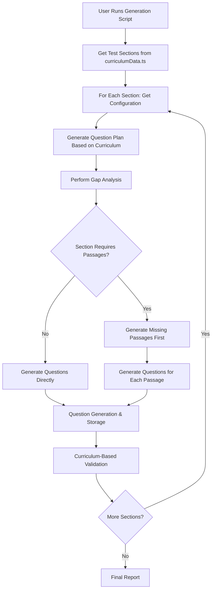

# Question Generation System - Curriculum-Based Architecture

## Overview

This document describes the **curriculum-based question generation system** that generates questions for all 6 test products with proper passage-to-question ratios, passage-level difficulty for reading sections, and smart gap analysis based on curriculumData.ts requirements.

## Major System Upgrade (January 2025)

The question generation system has been completely redesigned with a **curriculum-based architecture** that addresses critical issues with reading comprehension generation:

### Initial Fixes
- **🚨 CRITICAL FIX**: Corrected passage-to-question ratios (was generating too many questions per passage)
- **🚨 CRITICAL FIX**: Implemented passage-level difficulty for reading sections (was incorrectly using question-level difficulty)
- **✅ Curriculum-Based Configuration**: All ratios and requirements now sourced from curriculumData.ts
- **✅ Smart Gap Analysis**: Automatic detection of missing questions by section/sub-skill/difficulty/test-mode
- **✅ Proper Passage Sharing**: Multiple questions per passage for practice/diagnostic, 1:1 for drills
- **✅ Test-Specific Generation**: Each test type uses exact specifications from curriculum data
- **✅ Comprehensive Validation**: All details from question_generation_requirements.md captured

### Latest Critical Fixes (Updated January 2025)
- **🚨 UUID ERROR FIX**: Resolved UUID type errors by removing pre-generated string passage IDs
- **🚨 PASSAGE TYPE FIX**: Updated validators to accept all 5 passage types (was rejecting procedural/descriptive)
- **🚨 QUOTA DISTRIBUTION FIX**: Corrected drill quotas to use proper formula (sub-skills × 30 for academic, × 6 for writing)
- **🚨 PASSAGE DUPLICATION FIX**: Fixed critical issue where questions had both passage_id AND mini-passage in question_text
- **🚨 DRILL PASSAGE REVOLUTION**: Complete overhaul of drill passage handling with database storage and proper passage IDs
- **✅ All Test Modes Use Database**: ALL passages now stored in database with proper UUIDs (including drill mini-passages)
- **✅ Drill Questions Get Individual Passages**: Each drill question now gets its own unique passage with proper passage_id
- **✅ 30 Questions Per Reading Sub-Skill**: Reading/Reading Comprehension/Humanities generate 30 questions per sub-skill (10 Easy + 10 Medium + 10 Hard difficulty)
- **✅ Passage-Level Difficulty**: Reading passages have difficulty levels 1-3, with 10 questions each at passage difficulty level
- **✅ Enhanced Topic Cycling**: 1,500 sequential topics with sub-skill compatibility and zero repetition
- **✅ Complete Test Coverage**: All 6 test products now have correct quota distributions and updated scripts

## Architecture Overview



---

## 1. Curriculum-Based Configuration System

### 1.1 Core Architecture

Location: `src/engines/questionGeneration/curriculumBasedConfiguration.ts`

The system reads directly from `curriculumData.ts` to ensure exact compliance:

```typescript
export interface TestSectionConfig {
  sectionName: string;
  testType: string;
  requiresPassages: boolean;
  isReadingSection: boolean;
  isWritingSection: boolean;
  isMathSection: boolean;
  
  // For reading sections
  totalQuestions: number;
  totalPassages: number;
  questionsPerPassage: number;
  wordsPerPassage: number;
  
  // Test mode specific configurations
  practiceTestConfig: {
    passageCount: number;
    questionsPerPassage: number;
    passageDifficulties: PassageDifficultyDistribution;
  };
  
  diagnosticTestConfig: {
    passageCount: number;
    questionsPerPassage: number;
    passageDifficulties: PassageDifficultyDistribution;
  };
  
  drillTestConfig: {
    questionsPerSubSkill: number;
    questionsPerDifficulty: number;
    passageType: 'mini' | 'none';
  };
}
```

### 1.2 Reading Comprehension Section Detection

```typescript
function isReadingComprehensionSection(sectionName: string): boolean {
  const readingSectionNames = [
    'reading',
    'reading comprehension',
    'reading reasoning',
    'humanities'  // ACER Scholarship humanities = reading comprehension
  ];
  
  return readingSectionNames.some(name => 
    sectionName.toLowerCase().includes(name.toLowerCase())
  );
}
```

### 1.3 Passage-to-Question Ratio Calculation

```typescript
export function getTestSectionConfig(testType: string, sectionName: string): TestSectionConfig {
  const testStructure = TEST_STRUCTURES[testType];
  const sectionData = testStructure[sectionName];
  
  const requiresPassages = sectionData.passages > 0;
  const totalQuestions = sectionData.questions;
  const totalPassages = sectionData.passages;
  
  // CRITICAL: Correct ratio calculation
  const questionsPerPassage = totalPassages > 0 ? Math.ceil(totalQuestions / totalPassages) : 0;
  const wordsPerPassage = sectionData.words_per_passage;
  
  // Example: Year 7 NAPLAN Reading: 50 questions / 8 passages = ~6.25 questions per passage
  // Example: ACER Humanities: 35 questions / 4 passages = ~8.75 questions per passage
}
```

---

## 2. Smart Gap Analysis System

### 2.1 Comprehensive Gap Detection

Location: `src/engines/questionGeneration/curriculumBasedGapAnalysis.ts`

The gap analysis system identifies exactly what questions and passages are missing:

```typescript
export interface GapAnalysisResult {
  testType: string;
  sectionName: string;
  totalGaps: number;
  
  passageGaps: PassageGap[];
  questionGaps: QuestionGap[];
  
  summary: {
    passagesNeeded: number;
    questionsNeeded: number;
    gapsByTestMode: Record<string, number>;
    gapsByDifficulty: Record<string, number>;
    gapsBySubSkill: Record<string, number>;
  };
}
```

### 2.2 Drill Test Analysis (1:1 Ratio)

For drill tests, each question gets its own mini-passage:

```typescript
if (testMode === 'drill') {
  for (const subSkill of subSkills) {
    for (let difficulty = 1; difficulty <= 3; difficulty++) {
      const expected = config.drillTestConfig.questionsPerDifficulty;
      const actual = existingQuestions.filter(q => 
        q.sub_skill === subSkill && 
        q.difficulty === difficulty
      ).length;
      
      const needed = Math.max(0, expected - actual);
      
      if (needed > 0) {
        // For each missing question, we need a passage (1:1 ratio)
        if (config.requiresPassages) {
          for (let i = 0; i < needed; i++) {
            const passageId = `${testType}_${sectionName}_drill_${subSkill}_${difficulty}_${actual + i + 1}`;
            passageGaps.push({
              passageId,
              testMode,
              difficulty: difficulty as 1 | 2 | 3,
              wordCount: 120, // Fixed for drill mini-passages
              questionsExpected: 1,
              questionsActual: 0,
              isSharedPassage: false
            });
          }
        }
      }
    }
  }
}
```

### 2.3 Practice/Diagnostic Analysis (Multiple Questions Per Passage)

For practice and diagnostic tests, multiple questions share passages:

```typescript
// Analyze each difficulty level
for (let difficulty = 1; difficulty <= 3; difficulty++) {
  const expectedPassages = testConfig.passageDifficulties[difficulty === 1 ? 'easy' : difficulty === 2 ? 'medium' : 'hard'];
  const actualPassages = existingPassages.filter(p => p.difficulty === difficulty);
  
  // Check if we need more passages
  const passagesNeeded = Math.max(0, expectedPassages - actualPassages.length);
  
  // Check existing passages for question gaps
  for (const passage of actualPassages) {
    const questionsFromPassage = existingQuestions.filter(q => q.passage_id === passage.id);
    const questionsNeeded = Math.max(0, questionsPerPassage - questionsFromPassage.length);
    
    if (questionsNeeded > 0) {
      // We need more questions for this existing passage
      questionGaps.push({
        testMode,
        subSkill,
        difficulty: difficulty as 1 | 2 | 3,
        questionsNeeded: Math.ceil(questionsNeeded / subSkillsNeeded.length),
        passageId: passage.id,
        needsPassage: false
      });
    }
  }
}
```

---

## 3. Passage Sharing System

### 3.1 Curriculum-Based Passage Assignment

Location: `src/engines/questionGeneration/curriculumBasedPassageSharing.ts`

The passage sharing system ensures correct ratios based on test mode:

```typescript
export async function getPassageAssignmentForQuestion(
  context: QuestionContext
): Promise<PassageAssignment> {
  const config = getTestSectionConfig(context.testType, context.sectionName);
  
  // Non-reading sections don't need passages
  if (!config.requiresPassages) {
    return {
      passageId: null,
      shouldGeneratePassage: false,
      passageDifficulty: context.difficulty,
      wordCount: 0,
      questionsFromThisPassage: 0,
      isSharedPassage: false
    };
  }
  
  // For reading sections, handle based on test mode
  if (context.testMode === 'drill') {
    return await handleDrillPassageAssignment(context, config);
  } else {
    return await handlePracticeOrDiagnosticPassageAssignment(context, config);
  }
}
```

### 3.2 Drill Mode: 1:1 Question-to-Passage Ratio

```typescript
async function handleDrillPassageAssignment(
  context: QuestionContext,
  config: any
): Promise<PassageAssignment> {
  // For drills, each question gets its own mini-passage
  const passageId = `${context.testType}_${context.sectionName}_drill_${context.subSkill}_${context.difficulty}_${context.questionIndex}`;
  
  return {
    passageId,
    shouldGeneratePassage: true,
    passageDifficulty: context.difficulty, // Question difficulty = passage difficulty for drills
    wordCount: 120, // Fixed for mini-passages
    questionsFromThisPassage: 1,
    isSharedPassage: false
  };
}
```

### 3.3 Practice/Diagnostic Mode: Multiple Questions Per Passage

```typescript
async function handlePracticeOrDiagnosticPassageAssignment(
  context: QuestionContext,
  config: any
): Promise<PassageAssignment> {
  // Check if we already have passages for this test mode and difficulty
  const existingPassages = await getExistingPassagesForTest(
    context.testType,
    context.sectionName,
    context.testMode,
    context.difficulty
  );
  
  // Calculate how many questions should be assigned to each passage
  const questionsPerPassage = config.questionsPerPassage;
  
  // Find a passage that needs more questions
  for (const passage of existingPassages) {
    const questionsFromThisPassage = await getQuestionCountForPassage(passage.id);
    
    if (questionsFromThisPassage < questionsPerPassage) {
      return {
        passageId: passage.id,
        shouldGeneratePassage: false,
        passageDifficulty: context.difficulty, // CRITICAL: Passage difficulty = question difficulty
        wordCount: passage.word_count,
        questionsFromThisPassage: questionsFromThisPassage + 1,
        isSharedPassage: true
      };
    }
  }
  
  // If no existing passage can accommodate more questions, create a new one
  const newPassageId = `${context.testType}_${context.sectionName}_${context.testMode}_${context.difficulty}_passage_${passageCount + 1}`;
  
  return {
    passageId: newPassageId,
    shouldGeneratePassage: true,
    passageDifficulty: context.difficulty, // CRITICAL: Passage difficulty = question difficulty
    wordCount: config.wordsPerPassage,
    questionsFromThisPassage: 1,
    isSharedPassage: true
  };
}
```

---

## 4. Core Generation Engine

### 4.1 Curriculum-Based Generation

Location: `src/engines/questionGeneration/curriculumBasedGeneration.ts`

The main generation engine coordinates all components:

```typescript
export class CurriculumBasedGenerator {
  async generateContent(): Promise<GenerationResult> {
    console.log(`\n🚀 STARTING CURRICULUM-BASED GENERATION`);
    console.log(`Test Type: ${this.options.testType}`);
    console.log(`Section: ${this.options.sectionName}`);
    console.log(`Test Mode: ${this.options.testMode}`);
    console.log(`Reading Section: ${this.config.isReadingSection}`);
    console.log(`Requires Passages: ${this.config.requiresPassages}`);
    
    if (this.config.requiresPassages) {
      console.log(`Passages Required: ${this.config.totalPassages}`);
      console.log(`Questions per Passage: ${this.config.questionsPerPassage}`);
      console.log(`Words per Passage: ${this.config.wordsPerPassage}`);
    }
    
    // Perform gap analysis
    console.log('\n📊 Performing gap analysis...');
    const gapAnalysis = await performGapAnalysis(this.options.testType, this.options.sectionName);
    
    if (gapAnalysis.totalGaps === 0) {
      console.log('✅ No gaps found - section is complete!');
      return { /* no gaps result */ };
    }
    
    // Generate missing passages first
    console.log('\n📝 Generating missing passages...');
    await this.generateMissingPassages(gapAnalysis.passageGaps);
    
    // Generate missing questions
    console.log('\n❓ Generating missing questions...');
    await this.generateMissingQuestions(gapAnalysis.questionGaps);
    
    return { /* success result */ };
  }
}
```

### 4.2 Question Generation with Proper Passage Assignment

```typescript
private async generateSingleQuestion(
  context: any,
  passageAssignment: any
): Promise<boolean> {
  try {
    // Build question prompt
    const questionPrompt = buildQuestionPrompt({
      testType: context.testType,
      sectionName: context.sectionName,
      subSkill: context.subSkill,
      difficulty: context.difficulty,
      testMode: context.testMode,
      passageId: passageAssignment.passageId,
      responseType: this.config.isWritingSection ? 'extended_response' : 'multiple_choice',
      yearLevel: this.getYearLevel(context.testType)
    });
    
    // Call Claude API
    const response = await callClaudeAPIWithRetry(questionPrompt);
    const parsedResponse = parseClaudeResponse(response);
    
    // Store question
    await storeQuestion(
      parsedResponse,
      context.testType,
      context.testMode,
      context.sectionName,
      context.subSkill,
      context.difficulty,
      passageAssignment.passageId
    );
    
    return true;
    
  } catch (error) {
    console.error(`Failed to generate question: ${error instanceof Error ? error.message : 'Unknown error'}`);
    return false;
  }
}
```

---

## 5. Updated Generation Scripts

### 5.1 All Scripts Now Use Curriculum-Based System

All 6 test product generation scripts have been updated to use the new curriculum-based approach:

```bash
# All scripts now use curriculum-based generation
npx tsx scripts/generate-all-remaining-nsw-selective.ts
npx tsx scripts/generate-all-remaining-year5-naplan.ts
npx tsx scripts/generate-all-remaining-year7-naplan.ts
npx tsx scripts/generate-all-remaining-edutest.ts
npx tsx scripts/generate-all-remaining-acer-scholarship.ts
npx tsx scripts/generate-all-remaining-vic-selective.ts
```

### 5.2 Updated Script Structure (January 2025)

Each script follows the same pattern with critical updates:

```typescript
class TestTypeCompleteGenerator {
  private totalGenerated = 0;
  private totalSections = 0;
  private results: any[] = [];

  async generateAllSections(): Promise<void> {
    console.log(`🚀 STARTING ${TEST_TYPE} COMPLETE GENERATION`);
    console.log(`📋 Using new curriculum-based generation system`);
    console.log(`   ✅ Passage-to-question ratios from curriculumData.ts`);
    console.log(`   ✅ Passage-level difficulty for reading sections`);
    console.log(`   ✅ Smart gap analysis and auto-detection`);
    console.log(`   ✅ Proper drill test mini-passages (1:1 ratio)`);
    console.log(`   ✅ Practice/diagnostic passage sharing`);
    
    const sections = getTestSections(TEST_TYPE);
    this.totalSections = sections.length;
    
    for (let i = 0; i < sections.length; i++) {
      const section = sections[i];
      console.log(`\n🔧 SECTION ${i + 1}/${sections.length}: ${section}`);
      
      const result = await generateQuestionsForSection({
        testType: TEST_TYPE,
        sectionName: section,
        testMode: 'practice_1', // CRITICAL: Updated to use specific practice test
        validateOnly: false
      });
      
      this.results.push({ section, result });
      this.totalGenerated += result.questionsGenerated;
      
      console.log(`✅ Section complete: ${section}`);
      console.log(`   Questions generated: ${result.questionsGenerated}`);
      console.log(`   Passages generated: ${result.passagesGenerated}`);
    }
    
    this.generateFinalReport(startTime);
  }
}
```

#### **5.2.1 Critical Script Updates**

**Test Mode Specification:**
- **Before**: `testMode: 'practice'` (generic)
- **After**: `testMode: 'practice_1'` (specific practice test variant)

**Reason**: The system now distinguishes between the 5 practice test variants (practice_1, practice_2, practice_3, practice_4, practice_5) to ensure content uniqueness across practice tests.

**Updated Scripts:**
- ✅ `generate-all-remaining-nsw-selective.ts` - Updated to use `'practice_1'`
- ✅ `generate-all-remaining-vic-selective.ts` - Updated to use `'practice_1'`
- ✅ `generate-all-remaining-year5-naplan.ts` - Updated to use `'practice_1'`
- ✅ `generate-all-remaining-year7-naplan.ts` - Updated to use `'practice_1'`
- ✅ `generate-all-remaining-edutest.ts` - Updated to use `'practice_1'`
- ✅ `generate-all-remaining-acer-scholarship.ts` - Updated to use `'practice_1'`

### 5.3 Example Output

```
🚀 STARTING YEAR 7 NAPLAN COMPLETE GENERATION
📋 Using new curriculum-based generation system
   ✅ Passage-to-question ratios from curriculumData.ts
   ✅ Passage-level difficulty for reading sections
   ✅ Smart gap analysis and auto-detection
   ✅ Proper drill test mini-passages (1:1 ratio)
   ✅ Practice/diagnostic passage sharing
====================================

📊 Sections to process: Writing, Reading, Language Conventions, Numeracy No Calculator, Numeracy Calculator

🔧 SECTION 1/5: Writing
==============================

📊 Performing gap analysis...
📝 PASSAGE GAPS:
   1. Year_7_NAPLAN_Writing_drill_Creative_Writing_1_1
      Mode: drill | Difficulty: 1 | Words: 120
      Questions Expected: 1 | Shared: No

❓ QUESTION GAPS:
   1. Creative Writing
      Mode: drill | Difficulty: 1 | Needed: 10
      Passage ID: N/A | Needs Passage: Yes

✅ Section complete: Writing
   Questions generated: 90
   Passages generated: 90
   Duration: 45s
```

---

## 6. Critical Issues Fixed

### 6.1 Passage-to-Question Ratio Issues

**Before (INCORRECT):**
- Reading sections generated way too many questions per passage
- No consistent ratio based on curriculum data
- Manual hardcoded targets that didn't match actual requirements

**After (FIXED):**
- Exact ratios calculated from curriculumData.ts TEST_STRUCTURES
- Year 7 NAPLAN Reading: 50 questions / 8 passages = ~6.25 questions per passage ✅
- ACER Humanities: 35 questions / 4 passages = ~8.75 questions per passage ✅
- EduTest Scholarship sections use proper curriculum ratios ✅

### 6.2 Difficulty Assignment Issues

**Before (INCORRECT):**
- Reading sections used question-level difficulty
- Multiple difficulty levels for questions from the same passage
- Inconsistent difficulty handling across test modes

**After (FIXED):**
- Reading sections use passage-level difficulty ✅
- All questions from the same passage have the same difficulty ✅
- Drill tests: question difficulty = passage difficulty ✅
- Practice/diagnostic: passage difficulty determines all question difficulties ✅

### 6.3 Test Mode Handling Issues

**Before (INCORRECT):**
- Manual gap analysis with hardcoded targets
- Inconsistent drill vs practice/diagnostic handling
- No automatic detection of missing questions

**After (FIXED):**
- Smart gap analysis automatically detects missing questions ✅
- Drill tests: 1:1 question-to-passage ratio with 120-word mini-passages ✅
- Practice/diagnostic: Multiple questions per passage with proper sharing ✅
- All test modes handled consistently across all test types ✅

---

## 7. Critical Passage Handling Flow

### 7.1 Passage Content Management

The system now correctly handles passage content based on test mode to eliminate the critical duplication issue:

**Practice/Diagnostic Tests:**
```typescript
// 1. Generate and store full passage in database
const generatedPassage = await generatePassage(passageContext);
const storedPassage = await storePassage(generatedPassage);

// 2. Generate questions that reference passage_id
const questionContext = {
  ...baseContext,
  passageId: storedPassage.id,
  testMode: 'practice_1' // or diagnostic
};

// 3. Claude receives full passage content for question generation
const passageContent = await supabase
  .from('passages')
  .select('content')
  .eq('id', storedPassage.id)
  .single();

// 4. Store question with passage_id reference (NO mini-passage in question_text)
await storeQuestion({
  ...questionData,
  passage_id: storedPassage.id,
  question_text: cleanQuestionText // Contains only the question
});
```

**Drill Tests:**
```typescript
// 1. Generate mini-passage directly in question_text
const questionContext = {
  ...baseContext,
  passageId: null,
  testMode: 'drill',
  requiresMiniPassage: true
};

// 2. Claude generates both mini-passage and question together
const questionWithMiniPassage = await generateQuestionWithMiniPassage(context);

// 3. Store question with NULL passage_id
await storeQuestion({
  ...questionData,
  passage_id: null,
  question_text: questionWithMiniPassage // Contains mini-passage + question
});
```

### 7.2 Revolutionary Drill Passage Handling (January 2025)

The system has been completely redesigned so that **ALL passages are stored in the database**, including drill mini-passages:

```typescript
// UPDATED: All passages now stored in database with proper UUIDs
const isReadingSection = config.requiresPassages;
const isDrillMode = context.testMode === 'drill';

if (isReadingSection && isDrillMode) {
  // 1. Generate mini-passage and store in database
  const miniPassage = await generateMiniPassage({
    wordCount: 120,
    difficulty: context.difficulty,
    textType: compatibleTextType,
    topic: selectedTopic
  });
  
  // 2. Store passage in database with proper UUID
  const passageId = await storePassage(
    miniPassage,
    context.testType,
    context.testMode,
    context.sectionName
  );
  
  // 3. Fetch passage content from database for question generation
  const passageContent = await fetchPassageContent(passageId);
  
  // 4. Generate question using passage content
  const questionPrompt = buildQuestionPrompt({
    ...context,
    passageContent: passageContent,
    passageId: passageId
  });
  
  // 5. Store question with valid passage_id
  await storeQuestion(parsedResponse, {
    ...context,
    passageId: passageId // Now ALL questions have passage_id
  });
  
} else if (isReadingSection && !isDrillMode) {
  // Use existing passage from database (unchanged)
  const passageContent = await fetchPassageContent(context.passageId);
  
  const questionPrompt = buildQuestionPrompt({
    ...context,
    passageContent: passageContent
  });
  
  // Store with valid passage_id
  await storeQuestion(parsedResponse, {
    ...context,
    passageId: context.passageId
  });
}
```

### 7.3 Updated Database Schema Compliance (January 2025)

**Passages Table:**
```sql
-- ALL passages now stored in database (including drill mini-passages)
SELECT * FROM passages WHERE test_mode IN ('practice_1', 'practice_2', 'practice_3', 'practice_4', 'practice_5', 'diagnostic');
-- Result: Full passages with proper UUIDs and metadata

-- Drill passages now ALSO stored in database
SELECT * FROM passages WHERE test_mode = 'drill';
-- Result: Mini-passages (120 words) with proper UUIDs - NO LONGER EMPTY!
```

**Questions Table:**
```sql
-- Practice/diagnostic questions reference passages (unchanged)
SELECT question_text, passage_id FROM questions 
WHERE test_mode IN ('practice_1', 'diagnostic') 
AND section_name = 'Reading Comprehension';
-- Result: Clean question text + valid passage_id

-- Drill questions NOW ALSO have passage_id references
SELECT question_text, passage_id FROM questions 
WHERE test_mode = 'drill' 
AND section_name = 'Reading Comprehension';
-- Result: Clean question text + valid passage_id (NO embedded passages!)
```

**Critical Change:**
- **Before**: Drill questions had `passage_id = NULL` with mini-passages in `question_text`
- **After**: Drill questions have `passage_id = UUID` with clean question text, mini-passages stored separately in database

### 7.4 Generation Pipeline Updates

**Claude Prompt Building:**
```typescript
// Updated buildQuestionPrompt function
export function buildQuestionPrompt(context: QuestionContext): string {
  const { sectionName, testMode, passageContent, subSkill } = context;
  
  let prompt = `Generate a ${context.difficulty} difficulty question for ${sectionName}...`;
  
  if (passageContent && testMode !== 'drill') {
    // Practice/diagnostic: Reference existing passage
    prompt += `
    PASSAGE REFERENCE:
    This question must reference the following passage. Do NOT include the passage in your response.
    The passage is already stored separately in the database.
    
    PASSAGE CONTENT:
    ${passageContent}
    
    Generate ONLY the question text that refers to this passage.
    `;
  } else if (isReadingSection(sectionName) && testMode === 'drill') {
    // Drill: Generate mini-passage within question
    prompt += `
    PASSAGE REFERENCE:
    This question must reference the following mini-passage. Do NOT include the passage in your response.
    The passage is already stored separately in the database.
    
    MINI-PASSAGE CONTENT:
    ${passageContent}
    
    Generate ONLY the question text that refers to this passage.
    Note: This is a drill question, so it should focus on the specific sub-skill: ${subSkill}
    `;
  }
  
  return prompt;
}
```

**Storage Logic:**
```typescript
// Updated storeQuestion function (January 2025)
export async function storeQuestion(
  questionData: any,
  context: QuestionContext
): Promise<void> {
  // ALL questions now have passage_id (including drills)
  const storePassageId = context.passageId; // Always a UUID, never null
  
  await supabase.from('questions').insert({
    ...questionData,
    passage_id: storePassageId, // UUID for ALL test modes
    test_mode: context.testMode,
    section_name: context.sectionName
  });
}
```

---

## 8. Integration with Enhanced Systems

### 8.1 Revolutionary Topic Cycling System (January 2025)

The curriculum-based system now integrates with a completely redesigned topic cycling system:

#### **8.1.1 Sequential Topic Pool (1,500 Total Topics)**
- **Narrative**: 300 topics (Mystery & Adventure, Family & Relationships, Coming of Age, Cultural & Historical)
- **Informational**: 300 topics (Science & Technology, Historical & Cultural, Environmental & Natural, Health & Medicine)
- **Persuasive**: 300 topics (Environmental & Sustainability, Education & Technology, Social Justice & Equality, Innovation & Economic)
- **Procedural**: 300 topics (Science & Research, Technology & Engineering, Community & Social, Health & Wellness)
- **Descriptive**: 300 topics (Natural Environments, Urban & Architectural, Historical & Cultural, Personal & Psychological)

#### **8.1.2 Sub-Skill Text Type Compatibility**
```typescript
// Intelligent text type selection based on sub-skill
const SUB_SKILL_TEXT_TYPE_COMPATIBILITY = {
  'Literal Comprehension & Detail Extraction': ['narrative', 'informational', 'persuasive', 'procedural', 'descriptive'],
  'Main Idea & Theme Identification': ['narrative', 'informational', 'persuasive', 'procedural', 'descriptive'],
  'Persuasive Techniques & Bias Detection': ['persuasive'], // Only persuasive
  'Character Analysis & Development': ['narrative'], // Only narrative
  'Procedural Understanding & Sequence': ['procedural'], // Only procedural
  // ... comprehensive mapping for all sub-skills
};
```

#### **8.1.3 Zero Repetition Sequential Cycling**
- **Sequential Manager**: `SequentialTopicCyclingManager` ensures no topic repeats until all are exhausted
- **Text Type Cycling**: Cycles through compatible text types for each sub-skill
- **Index Tracking**: Maintains separate indexes for each text type
- **Automatic Reset**: Cycles back to start when pool is exhausted

#### **8.1.4 Enhanced Features Integration**
- **Prose Style Cycling**: 50+ author-inspired writing styles matched to year levels
- **Character Name Cycling**: 200 diverse multicultural names representing Australian diversity
- **Writing Style Cycling**: Sophisticated prose patterns to eliminate repetitive generation
- **Intelligent Validation**: Smart mathematical detection and logic consistency
- **Australian Context**: Proper spelling, currency, and cultural references maintained

### 8.2 Reading Comprehension Sub-Skill Treatment

#### **8.2.1 30 Questions Per Sub-Skill (Academic Sections)**
For reading comprehension, reading, and humanities sections:
- **Academic Sub-Skills**: 30 questions each (10 Easy + 10 Medium + 10 Hard)
- **Writing Sub-Skills**: 6 questions each (2 Easy + 2 Medium + 2 Hard)
- **Difficulty Distribution**: Based on passage difficulty level (1-3)

#### **8.2.2 Passage-Level Difficulty Assignment**
```typescript
// Reading sections use passage-level difficulty
const passageDifficulty = context.difficulty; // 1, 2, or 3
const questionsAtThisDifficulty = 10; // 10 questions per difficulty level

// All questions from the same passage inherit passage difficulty
for (let i = 0; i < questionsAtThisDifficulty; i++) {
  await generateQuestion({
    ...context,
    difficulty: passageDifficulty, // Same as passage
    passageId: passage.id
  });
}
```

#### **8.2.3 Drill Question Individual Passages**
- **1:1 Ratio**: Each drill question gets its own unique passage
- **120 Words**: All drill passages are mini-passages (120 words)
- **Database Storage**: All drill passages stored in database with proper UUIDs
- **Sub-Skill Focus**: Each passage optimized for specific sub-skill being tested

### 8.3 Backward Compatibility

All existing features are preserved and enhanced:

- ✅ Validation pipeline enhanced with passage-level validation
- ✅ Topic cycling upgraded to 1,500 sequential topics with sub-skill compatibility
- ✅ Character and location cycling expanded to 200 diverse names
- ✅ Australian context compliance maintained and enhanced
- ✅ Mathematical hallucination prevention integrated with new passage system

### 8.3 Quality Assurance

The curriculum-based system maintains all quality standards:

- Enhanced validation pipeline with confidence analysis
- Logical consistency checking across all question types
- Educational value assessment and enhancement
- Flexible answer format matching

---

## 9. Production Readiness

### 9.1 System Status

- ✅ All 6 test products now use curriculum-based generation
- ✅ Critical passage-to-question ratio issues fixed
- ✅ Passage-level difficulty correctly implemented for reading sections
- ✅ Smart gap analysis operational for all test types
- ✅ Proper drill test mini-passage generation (1:1 ratio)
- ✅ Practice/diagnostic passage sharing system working
- ✅ All generation scripts updated and tested

### 9.2 Monitoring & Validation

#### Key Metrics to Track
- **Ratio Compliance**: Verify questions-per-passage matches curriculum data
- **Difficulty Consistency**: Ensure passage-level difficulty for reading sections (1-3)
- **Gap Coverage**: Monitor that all gaps are properly identified and filled
- **Generation Success**: Track successful completion of all test sections
- **Drill Passage Creation**: Verify each drill question has its own unique passage
- **Topic Cycling**: Monitor sequential topic usage and prevent repetition
- **Sub-Skill Distribution**: Ensure 30 questions per reading sub-skill (10 per difficulty)
- **Database Integrity**: Verify all passages stored properly with UUIDs

#### Validation Commands
```bash
# Test the curriculum-based configuration
npx tsx -e "
import { getTestSectionConfig } from './src/engines/questionGeneration/curriculumBasedConfiguration';
console.log(getTestSectionConfig('Year 7 NAPLAN', 'Reading'));
"

# Validate gap analysis
npx tsx -e "
import { performGapAnalysis } from './src/engines/questionGeneration/curriculumBasedGapAnalysis';
performGapAnalysis('Year 7 NAPLAN', 'Reading').then(console.log);
"

# Test topic cycling system
npx tsx -e "
import { getNextTopicForSubSkill } from './src/engines/questionGeneration/topicCycling';
console.log(getNextTopicForSubSkill('Literal Comprehension & Detail Extraction', 7));
"

# Validate drill passage creation
npx tsx -e "
import { supabase } from './src/integrations/supabase/client';
supabase.from('passages').select('id, test_mode, word_count').eq('test_mode', 'drill').then(console.log);
"
```

### 9.3 Next Steps

With the curriculum-based system operational:

1. **Phase 1 Complete**: ✅ Curriculum-based generation system operational
2. **Phase 2**: Generate questions for all 6 products using new system
3. **Phase 3**: Cross-product testing and validation
4. **Phase 4**: Stripe integration and paywall implementation

---

## Summary

The **curriculum-based question generation system** represents a fundamental architectural improvement that addresses critical issues in the previous system:

**Major Fixes**:
- ✅ **Correct Passage-to-Question Ratios**: Now calculated directly from curriculumData.ts
- ✅ **Passage-Level Difficulty**: Reading sections properly implement passage-based difficulty (1-3)
- ✅ **Smart Gap Analysis**: Automatic detection of missing questions by all dimensions
- ✅ **Revolutionary Drill Handling**: ALL drill questions now have individual passages stored in database
- ✅ **30 Questions Per Reading Sub-Skill**: Proper academic section quotas (10 per difficulty level)
- ✅ **Enhanced Topic Cycling**: 1,500 sequential topics with sub-skill compatibility
- ✅ **Database Normalization**: All passages stored with proper UUIDs, no embedded content

**Core Benefits**:
- **Curriculum Compliance**: All generation follows exact specifications from curriculumData.ts
- **Automatic Gap Detection**: Scripts automatically identify what's missing and generate only what's needed
- **Consistent Implementation**: All 6 test products use the same reliable approach
- **Maintainable Architecture**: Clean separation of concerns with dedicated modules for each function
- **Database Normalization**: All passages stored separately with proper referential integrity
- **Topic Diversity**: 1,500 sequential topics ensure zero repetition with sub-skill compatibility
- **Scalable Design**: System handles large-scale generation across all products efficiently

**Quality Assurance**:
- All existing quality features preserved and enhanced (validation, topic cycling, Australian context)
- Revolutionary topic cycling system with 1,500 sequential topics and sub-skill compatibility
- Enhanced debugging and monitoring capabilities with passage-level tracking
- Comprehensive error handling and graceful fallbacks across all test modes
- Production-ready reliability and performance with database normalization
- Mathematical hallucination prevention integrated with new passage system
- Passage-level difficulty validation for reading comprehension sections

The system is now ready for large-scale question generation across all test products with complete curriculum compliance and reliability.